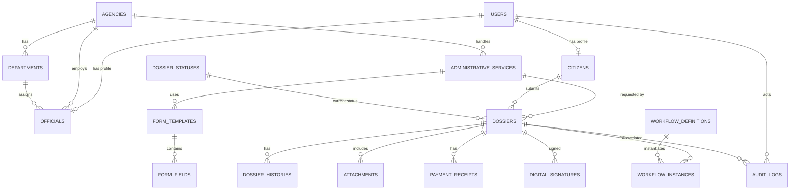
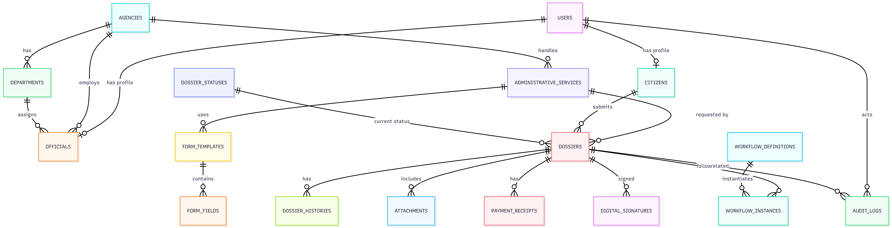

# Thiết kế hệ thống Dịch vụ hành chính công (Cổng DVC trực tuyến)

## 1. Tổng quan hệ thống

### 1.1. Mục tiêu

Hệ thống cung cấp nền tảng trực tuyến để **Công dân nộp hồ sơ điện tử** cho các **dịch vụ hành chính công**, theo dõi tiến độ xử lý, nhận kết quả; đồng thời hỗ trợ **Cán bộ xử lý** tiếp nhận – thẩm định – xử lý – trả kết quả theo quy trình nghiệp vụ, và hỗ trợ **Quản trị viên báo cáo** tổng hợp thống kê phục vụ điều hành.

### 1.2. Đối tượng người dùng chính

- **Công dân**: đăng ký/đăng nhập, cập nhật hồ sơ cá nhân, nộp hồ sơ, bổ sung hồ sơ, theo dõi và nhận kết quả.
- **Cán bộ xử lý**: tiếp nhận hồ sơ, phân công/luân chuyển nội bộ, yêu cầu bổ sung, phê duyệt/từ chối, ký số, trả kết quả.
- **Quản trị viên báo cáo**: xem báo cáo, thống kê hiệu suất xử lý, giám sát SLA, phân tích theo đơn vị/cấp hành chính/dịch vụ.

## 2. Yêu cầu nghiệp vụ chính

Tóm tắt yêu cầu nghiệp vụ:

- **Tài khoản công dân chứa thông tin cá nhân cố định**: thông tin định danh, liên hệ, địa chỉ thường trú/tạm trú… phục vụ tự điền biểu mẫu.
- **Danh mục dịch vụ hành chính công**: quản lý danh sách dịch vụ (mã dịch vụ, mô tả, thành phần hồ sơ, đơn vị thụ lý, thời hạn giải quyết, phí/lệ phí…).
- **Quy trình hồ sơ điện tử**: Công dân nộp → hệ thống tiếp nhận → cán bộ xử lý theo các bước → trả kết quả (kèm lịch sử trạng thái, nhật ký xử lý, trao đổi yêu cầu bổ sung).
- **Lưu trữ lâu dài**: lưu trữ hồ sơ, lịch sử, tệp đính kèm **hàng chục năm**, tra cứu mọi lúc (theo mã hồ sơ, công dân, trạng thái, thời gian, cơ quan thụ lý…).
- **Báo cáo, thống kê**: số lượng hồ sơ theo dịch vụ/đơn vị/thời gian, tỷ lệ đúng hạn/quá hạn, thời gian xử lý trung bình, tỷ lệ yêu cầu bổ sung, tỷ lệ từ chối…

## 3. Thiết kế cơ sở dữ liệu MySQL

### 3.1. Nguyên tắc thiết kế

- **Phân tách xác thực & hồ sơ**: `users` (tài khoản/role) tách khỏi `citizens`/`officials` (thông tin nghiệp vụ).
- **Truy vết đầy đủ**: `dossier_histories` + `audit_logs` đảm bảo khả năng kiểm tra/đối soát.
- **Lưu trữ lâu dài**: dữ liệu nghiệp vụ trong MySQL; tệp đính kèm ưu tiên lưu **object storage** (S3/MinIO) và lưu metadata trong `attachments` (checksum, đường dẫn…).
- **Soft delete** cho các bảng nghiệp vụ quan trọng bằng `deleted_at` (tránh mất dấu vết).
- **Chuẩn hoá trạng thái**: bảng `dossier_statuses` để linh hoạt thay đổi/khai báo luồng.

### 3.2. ERD (Mermaid)





### 3.3. Danh sách bảng & mô tả cột (mức logic)

#### 3.3.1. `users` (tài khoản hệ thống)

| Cột | Kiểu | Ràng buộc | Index | Mô tả |
|---|---|---|---|---|
| id | BIGINT UNSIGNED | PK, AI, NOT NULL | PK | Khóa chính |
| username | VARCHAR(100) | NOT NULL, UNIQUE | UQ | Tên đăng nhập (có thể là số CCCD/email/điện thoại tuỳ chính sách) |
| password_hash | VARCHAR(255) | NOT NULL |  | Mật khẩu băm (bcrypt/argon2) |
| role | ENUM('CITIZEN','OFFICIAL','REPORT_ADMIN') | NOT NULL | IDX | Vai trò RBAC |
| is_active | TINYINT(1) | NOT NULL DEFAULT 1 | IDX | Trạng thái hoạt động |
| last_login_at | DATETIME | NULL |  | Lần đăng nhập gần nhất |
| created_at | DATETIME | NOT NULL DEFAULT CURRENT_TIMESTAMP | IDX | Thời điểm tạo |
| updated_at | DATETIME | NOT NULL DEFAULT CURRENT_TIMESTAMP ON UPDATE CURRENT_TIMESTAMP |  | Thời điểm cập nhật |
| deleted_at | DATETIME | NULL | IDX | Soft delete |

#### 3.3.2. `citizens` (hồ sơ công dân)

| Cột | Kiểu | Ràng buộc | Index | Mô tả |
|---|---|---|---|---|
| id | BIGINT UNSIGNED | PK, AI, NOT NULL | PK | Khóa chính |
| user_id | BIGINT UNSIGNED | NOT NULL, UNIQUE | UQ, FK | Tham chiếu `users.id` |
| full_name | VARCHAR(200) | NOT NULL | IDX | Họ và tên |
| date_of_birth | DATE | NULL |  | Ngày sinh |
| gender | ENUM('MALE','FEMALE','OTHER') | NULL |  | Giới tính |
| national_id | VARCHAR(20) | NOT NULL, UNIQUE | UQ | Số CCCD/CMND (mã định danh) |
| email | VARCHAR(200) | NULL | IDX | Email |
| phone | VARCHAR(20) | NULL | IDX | Số điện thoại |
| permanent_address | VARCHAR(500) | NULL |  | Địa chỉ thường trú |
| current_address | VARCHAR(500) | NULL |  | Địa chỉ hiện tại |
| created_at | DATETIME | NOT NULL DEFAULT CURRENT_TIMESTAMP | IDX | Thời điểm tạo |
| updated_at | DATETIME | NOT NULL DEFAULT CURRENT_TIMESTAMP ON UPDATE CURRENT_TIMESTAMP |  | Thời điểm cập nhật |
| deleted_at | DATETIME | NULL | IDX | Soft delete |

#### 3.3.3. `agencies` (cơ quan thụ lý)

| Cột | Kiểu | Ràng buộc | Index | Mô tả |
|---|---|---|---|---|
| id | BIGINT UNSIGNED | PK, AI, NOT NULL | PK | Khóa chính |
| agency_code | VARCHAR(50) | NOT NULL, UNIQUE | UQ | Mã cơ quan |
| name | VARCHAR(255) | NOT NULL | IDX | Tên cơ quan |
| level | ENUM('CENTRAL','PROVINCE','DISTRICT','COMMUNE') | NOT NULL | IDX | Cấp hành chính |
| address | VARCHAR(500) | NULL |  | Địa chỉ |
| phone | VARCHAR(20) | NULL |  | Điện thoại |
| created_at | DATETIME | NOT NULL DEFAULT CURRENT_TIMESTAMP |  | Thời điểm tạo |
| updated_at | DATETIME | NOT NULL DEFAULT CURRENT_TIMESTAMP ON UPDATE CURRENT_TIMESTAMP |  | Thời điểm cập nhật |
| deleted_at | DATETIME | NULL | IDX | Soft delete |

#### 3.3.4. `departments` (phòng/ban thuộc cơ quan)

| Cột | Kiểu | Ràng buộc | Index | Mô tả |
|---|---|---|---|---|
| id | BIGINT UNSIGNED | PK, AI, NOT NULL | PK | Khóa chính |
| agency_id | BIGINT UNSIGNED | NOT NULL | FK, IDX | Tham chiếu `agencies.id` |
| dept_code | VARCHAR(50) | NOT NULL | IDX | Mã phòng/ban |
| name | VARCHAR(255) | NOT NULL | IDX | Tên phòng/ban |
| created_at | DATETIME | NOT NULL DEFAULT CURRENT_TIMESTAMP |  | Thời điểm tạo |
| updated_at | DATETIME | NOT NULL DEFAULT CURRENT_TIMESTAMP ON UPDATE CURRENT_TIMESTAMP |  | Thời điểm cập nhật |
| deleted_at | DATETIME | NULL | IDX | Soft delete |

#### 3.3.5. `officials` (cán bộ xử lý)

| Cột | Kiểu | Ràng buộc | Index | Mô tả |
|---|---|---|---|---|
| id | BIGINT UNSIGNED | PK, AI, NOT NULL | PK | Khóa chính |
| user_id | BIGINT UNSIGNED | NOT NULL, UNIQUE | UQ, FK | Tham chiếu `users.id` |
| agency_id | BIGINT UNSIGNED | NOT NULL | FK, IDX | Cơ quan công tác |
| department_id | BIGINT UNSIGNED | NULL | FK, IDX | Phòng/ban |
| full_name | VARCHAR(200) | NOT NULL | IDX | Họ và tên |
| employee_code | VARCHAR(50) | NULL, UNIQUE | UQ | Mã cán bộ |
| position_title | VARCHAR(200) | NULL |  | Chức danh |
| created_at | DATETIME | NOT NULL DEFAULT CURRENT_TIMESTAMP |  | Thời điểm tạo |
| updated_at | DATETIME | NOT NULL DEFAULT CURRENT_TIMESTAMP ON UPDATE CURRENT_TIMESTAMP |  | Thời điểm cập nhật |
| deleted_at | DATETIME | NULL | IDX | Soft delete |

#### 3.3.6. `administrative_services` (danh mục dịch vụ hành chính công)

| Cột | Kiểu | Ràng buộc | Index | Mô tả |
|---|---|---|---|---|
| id | BIGINT UNSIGNED | PK, AI, NOT NULL | PK | Khóa chính |
| service_code | VARCHAR(50) | NOT NULL, UNIQUE | UQ | Mã dịch vụ |
| name | VARCHAR(255) | NOT NULL | IDX | Tên dịch vụ |
| description | TEXT | NULL |  | Mô tả |
| agency_id | BIGINT UNSIGNED | NOT NULL | FK, IDX | Cơ quan thụ lý chính |
| processing_days | INT UNSIGNED | NOT NULL DEFAULT 0 |  | Thời hạn giải quyết (ngày làm việc) |
| fee_amount | DECIMAL(18,2) | NOT NULL DEFAULT 0 |  | Phí/lệ phí (nếu có) |
| is_active | TINYINT(1) | NOT NULL DEFAULT 1 | IDX | Trạng thái áp dụng |
| created_at | DATETIME | NOT NULL DEFAULT CURRENT_TIMESTAMP |  | Thời điểm tạo |
| updated_at | DATETIME | NOT NULL DEFAULT CURRENT_TIMESTAMP ON UPDATE CURRENT_TIMESTAMP |  | Thời điểm cập nhật |
| deleted_at | DATETIME | NULL | IDX | Soft delete |

#### 3.3.7. `dossier_statuses` (trạng thái hồ sơ)

| Cột | Kiểu | Ràng buộc | Index | Mô tả |
|---|---|---|---|---|
| id | BIGINT UNSIGNED | PK, AI, NOT NULL | PK | Khóa chính |
| status_code | VARCHAR(50) | NOT NULL, UNIQUE | UQ | Mã trạng thái (VD: SUBMITTED, RECEIVED, PROCESSING, SUPPLEMENT_REQUIRED, REJECTED, COMPLETED, RETURNED) |
| name | VARCHAR(100) | NOT NULL |  | Tên hiển thị |
| is_terminal | TINYINT(1) | NOT NULL DEFAULT 0 | IDX | Trạng thái kết thúc quy trình |
| created_at | DATETIME | NOT NULL DEFAULT CURRENT_TIMESTAMP |  | Thời điểm tạo |
| updated_at | DATETIME | NOT NULL DEFAULT CURRENT_TIMESTAMP ON UPDATE CURRENT_TIMESTAMP |  | Thời điểm cập nhật |

#### 3.3.8. `dossiers` (hồ sơ đăng ký dịch vụ)

| Cột | Kiểu | Ràng buộc | Index | Mô tả |
|---|---|---|---|---|
| id | BIGINT UNSIGNED | PK, AI, NOT NULL | PK | Khóa chính |
| dossier_code | VARCHAR(30) | NOT NULL, UNIQUE | UQ | Mã hồ sơ (hiển thị/tra cứu) |
| citizen_id | BIGINT UNSIGNED | NOT NULL | FK, IDX | Công dân nộp |
| service_id | BIGINT UNSIGNED | NOT NULL | FK, IDX | Dịch vụ đăng ký |
| agency_id | BIGINT UNSIGNED | NOT NULL | FK, IDX | Cơ quan thụ lý (đóng băng theo thời điểm nộp) |
| form_template_id | BIGINT UNSIGNED | NULL | FK, IDX | Biểu mẫu động sử dụng (tham chiếu `form_templates.id`) |
| current_status_id | BIGINT UNSIGNED | NOT NULL | FK, IDX | Trạng thái hiện tại |
| subject | VARCHAR(255) | NULL | IDX | Tiêu đề/ngắn gọn nội dung |
| form_data_json | JSON | NULL |  | Dữ liệu biểu mẫu (động) |
| submitted_at | DATETIME | NOT NULL | IDX | Thời điểm nộp |
| received_at | DATETIME | NULL | IDX | Thời điểm tiếp nhận |
| due_at | DATETIME | NULL | IDX | Hạn xử lý dự kiến (phục vụ SLA) |
| completed_at | DATETIME | NULL | IDX | Thời điểm hoàn tất |
| created_at | DATETIME | NOT NULL DEFAULT CURRENT_TIMESTAMP | IDX | Thời điểm tạo |
| updated_at | DATETIME | NOT NULL DEFAULT CURRENT_TIMESTAMP ON UPDATE CURRENT_TIMESTAMP | IDX | Thời điểm cập nhật |
| deleted_at | DATETIME | NULL | IDX | Soft delete |

#### 3.3.9. `dossier_histories` (lịch sử xử lý từng bước)

| Cột | Kiểu | Ràng buộc | Index | Mô tả |
|---|---|---|---|---|
| id | BIGINT UNSIGNED | PK, AI, NOT NULL | PK | Khóa chính |
| dossier_id | BIGINT UNSIGNED | NOT NULL | FK, IDX | Tham chiếu `dossiers.id` |
| actor_user_id | BIGINT UNSIGNED | NOT NULL | FK, IDX | Người thực hiện thao tác (cán bộ/công dân/hệ thống) |
| action | VARCHAR(100) | NOT NULL | IDX | Hành động (SUBMIT, RECEIVE, ASSIGN, REQUEST_SUPPLEMENT, SUPPLEMENT_SUBMIT, APPROVE, REJECT, COMPLETE, RETURN_RESULT, NOTE...) |
| from_status_id | BIGINT UNSIGNED | NULL | FK | Trạng thái trước |
| to_status_id | BIGINT UNSIGNED | NULL | FK, IDX | Trạng thái sau |
| note | TEXT | NULL |  | Ghi chú nghiệp vụ |
| meta_json | JSON | NULL |  | Metadata (số văn bản, thông tin ký số, kênh trả kết quả...) |
| created_at | DATETIME | NOT NULL DEFAULT CURRENT_TIMESTAMP | IDX | Thời điểm phát sinh |

#### 3.3.10. `attachments` (tệp đính kèm)

| Cột | Kiểu | Ràng buộc | Index | Mô tả |
|---|---|---|---|---|
| id | BIGINT UNSIGNED | PK, AI, NOT NULL | PK | Khóa chính |
| dossier_id | BIGINT UNSIGNED | NOT NULL | FK, IDX | Thuộc hồ sơ |
| uploaded_by_user_id | BIGINT UNSIGNED | NOT NULL | FK, IDX | Người tải lên |
| file_name | VARCHAR(255) | NOT NULL |  | Tên file gốc |
| content_type | VARCHAR(100) | NULL |  | MIME type |
| file_size | BIGINT UNSIGNED | NOT NULL |  | Kích thước (bytes) |
| storage_provider | ENUM('S3','MINIO','LOCAL','OTHER') | NOT NULL DEFAULT 'S3' |  | Nơi lưu |
| storage_path | VARCHAR(500) | NOT NULL | IDX | Đường dẫn/Key object storage |
| sha256 | CHAR(64) | NULL | IDX | Checksum toàn vẹn |
| is_deleted | TINYINT(1) | NOT NULL DEFAULT 0 | IDX | Cờ xoá logic tệp |
| created_at | DATETIME | NOT NULL DEFAULT CURRENT_TIMESTAMP | IDX | Thời điểm tải lên |

#### 3.3.11. `audit_logs` (nhật ký kiểm toán hệ thống)

| Cột | Kiểu | Ràng buộc | Index | Mô tả |
|---|---|---|---|---|
| id | BIGINT UNSIGNED | PK, AI, NOT NULL | PK | Khóa chính |
| actor_user_id | BIGINT UNSIGNED | NULL | FK, IDX | Người thao tác (NULL nếu hệ thống) |
| event_type | VARCHAR(100) | NOT NULL | IDX | Loại sự kiện (AUTH_LOGIN, DOSSIER_VIEW, DOSSIER_UPDATE, EXPORT_REPORT, ...) |
| entity_type | VARCHAR(50) | NULL | IDX | Loại đối tượng (DOSSIER, CITIZEN, SERVICE, ...) |
| entity_id | BIGINT UNSIGNED | NULL | IDX | ID đối tượng liên quan |
| dossier_id | BIGINT UNSIGNED | NULL | FK, IDX | Liên kết nhanh tới hồ sơ (nếu có) |
| ip_address | VARCHAR(45) | NULL |  | IPv4/IPv6 |
| user_agent | VARCHAR(255) | NULL |  | Thông tin trình duyệt |
| detail_json | JSON | NULL |  | Chi tiết sự kiện |
| created_at | DATETIME | NOT NULL DEFAULT CURRENT_TIMESTAMP | IDX | Thời điểm phát sinh |

#### 3.3.12. `form_templates` (biểu mẫu động - template)

| Cột | Kiểu | Ràng buộc | Index | Mô tả |
|---|---|---|---|---|
| id | BIGINT UNSIGNED | PK, AI, NOT NULL | PK | Khóa chính |
| template_code | VARCHAR(50) | NOT NULL, UNIQUE | UQ | Mã biểu mẫu |
| service_id | BIGINT UNSIGNED | NOT NULL | FK, IDX | Dịch vụ sử dụng biểu mẫu |
| name | VARCHAR(255) | NOT NULL | IDX | Tên biểu mẫu |
| description | TEXT | NULL |  | Mô tả biểu mẫu |
| version | INT UNSIGNED | NOT NULL DEFAULT 1 | IDX | Phiên bản biểu mẫu |
| form_schema_json | JSON | NOT NULL |  | Schema định nghĩa cấu trúc biểu mẫu (JSON Schema format) |
| is_active | TINYINT(1) | NOT NULL DEFAULT 1 | IDX | Trạng thái áp dụng |
| created_by_user_id | BIGINT UNSIGNED | NULL | FK | Người tạo |
| created_at | DATETIME | NOT NULL DEFAULT CURRENT_TIMESTAMP | IDX | Thời điểm tạo |
| updated_at | DATETIME | NOT NULL DEFAULT CURRENT_TIMESTAMP ON UPDATE CURRENT_TIMESTAMP |  | Thời điểm cập nhật |
| deleted_at | DATETIME | NULL | IDX | Soft delete |

#### 3.3.13. `form_fields` (trường dữ liệu trong biểu mẫu)

| Cột | Kiểu | Ràng buộc | Index | Mô tả |
|---|---|---|---|---|
| id | BIGINT UNSIGNED | PK, AI, NOT NULL | PK | Khóa chính |
| template_id | BIGINT UNSIGNED | NOT NULL | FK, IDX | Tham chiếu `form_templates.id` |
| field_key | VARCHAR(100) | NOT NULL | IDX | Key của trường (dùng trong form_data_json) |
| field_label | VARCHAR(255) | NOT NULL |  | Nhãn hiển thị |
| field_type | ENUM('TEXT','NUMBER','DATE','EMAIL','PHONE','SELECT','MULTISELECT','TEXTAREA','FILE','CHECKBOX','RADIO') | NOT NULL | IDX | Kiểu dữ liệu |
| is_required | TINYINT(1) | NOT NULL DEFAULT 0 |  | Bắt buộc nhập |
| validation_rules_json | JSON | NULL |  | Quy tắc validation (min, max, pattern, ...) |
| options_json | JSON | NULL |  | Tùy chọn cho SELECT/RADIO/CHECKBOX |
| display_order | INT UNSIGNED | NOT NULL DEFAULT 0 | IDX | Thứ tự hiển thị |
| created_at | DATETIME | NOT NULL DEFAULT CURRENT_TIMESTAMP |  | Thời điểm tạo |
| updated_at | DATETIME | NOT NULL DEFAULT CURRENT_TIMESTAMP ON UPDATE CURRENT_TIMESTAMP |  | Thời điểm cập nhật |

#### 3.3.14. `payment_receipts` (phiếu thu - thanh toán phí/lệ phí)

| Cột | Kiểu | Ràng buộc | Index | Mô tả |
|---|---|---|---|---|
| id | BIGINT UNSIGNED | PK, AI, NOT NULL | PK | Khóa chính |
| receipt_code | VARCHAR(50) | NOT NULL, UNIQUE | UQ | Mã phiếu thu (hiển thị/tra cứu) |
| dossier_id | BIGINT UNSIGNED | NOT NULL | FK, IDX | Hồ sơ liên quan |
| citizen_id | BIGINT UNSIGNED | NOT NULL | FK, IDX | Công dân nộp phí |
| amount | DECIMAL(18,2) | NOT NULL | IDX | Số tiền phải thu |
| paid_amount | DECIMAL(18,2) | NOT NULL DEFAULT 0 |  | Số tiền đã thanh toán |
| payment_method | ENUM('CASH','BANK_TRANSFER','CREDIT_CARD','E_WALLET','OTHER') | NULL | IDX | Phương thức thanh toán |
| payment_status | ENUM('PENDING','PAID','PARTIAL','REFUNDED','CANCELLED') | NOT NULL DEFAULT 'PENDING' | IDX | Trạng thái thanh toán |
| payment_reference | VARCHAR(100) | NULL | IDX | Số tham chiếu giao dịch (mã giao dịch ngân hàng, ...) |
| paid_at | DATETIME | NULL | IDX | Thời điểm thanh toán |
| receipt_attachment_id | BIGINT UNSIGNED | NULL | FK | File phiếu thu đã xuất |
| note | TEXT | NULL |  | Ghi chú |
| created_at | DATETIME | NOT NULL DEFAULT CURRENT_TIMESTAMP | IDX | Thời điểm tạo |
| updated_at | DATETIME | NOT NULL DEFAULT CURRENT_TIMESTAMP ON UPDATE CURRENT_TIMESTAMP | IDX | Thời điểm cập nhật |
| deleted_at | DATETIME | NULL | IDX | Soft delete |

#### 3.3.15. `digital_signatures` (ký số - chữ ký điện tử)

| Cột | Kiểu | Ràng buộc | Index | Mô tả |
|---|---|---|---|---|
| id | BIGINT UNSIGNED | PK, AI, NOT NULL | PK | Khóa chính |
| signature_code | VARCHAR(50) | NOT NULL, UNIQUE | UQ | Mã chữ ký (tra cứu) |
| dossier_id | BIGINT UNSIGNED | NOT NULL | FK, IDX | Hồ sơ được ký |
| signer_user_id | BIGINT UNSIGNED | NOT NULL | FK, IDX | Người ký (cán bộ) |
| signature_type | ENUM('APPROVE','REJECT','COMPLETE','RETURN_RESULT','OTHER') | NOT NULL | IDX | Loại chữ ký |
| certificate_serial | VARCHAR(200) | NOT NULL | IDX | Serial số chứng thư số |
| certificate_issuer | VARCHAR(255) | NULL |  | Tổ chức cấp chứng thư |
| certificate_subject | VARCHAR(500) | NULL |  | Thông tin chủ thể chứng thư |
| signed_content_hash | VARCHAR(64) | NOT NULL | IDX | Hash SHA256 của nội dung đã ký |
| signature_value | TEXT | NOT NULL |  | Giá trị chữ ký (base64 encoded) |
| signed_document_attachment_id | BIGINT UNSIGNED | NULL | FK | File tài liệu đã ký |
| signed_at | DATETIME | NOT NULL | IDX | Thời điểm ký |
| ip_address | VARCHAR(45) | NULL |  | Địa chỉ IP khi ký |
| is_valid | TINYINT(1) | NOT NULL DEFAULT 1 | IDX | Trạng thái hợp lệ (có thể bị thu hồi sau) |
| revoked_at | DATETIME | NULL | IDX | Thời điểm thu hồi (nếu có) |
| revocation_reason | TEXT | NULL |  | Lý do thu hồi |
| meta_json | JSON | NULL |  | Metadata bổ sung |
| created_at | DATETIME | NOT NULL DEFAULT CURRENT_TIMESTAMP | IDX | Thời điểm tạo bản ghi |

#### 3.3.16. `workflow_definitions` (định nghĩa luồng xử lý BPMN)

| Cột | Kiểu | Ràng buộc | Index | Mô tả |
|---|---|---|---|---|
| id | BIGINT UNSIGNED | PK, AI, NOT NULL | PK | Khóa chính |
| workflow_code | VARCHAR(50) | NOT NULL, UNIQUE | UQ | Mã luồng xử lý |
| service_id | BIGINT UNSIGNED | NULL | FK, IDX | Dịch vụ áp dụng (NULL nếu dùng chung) |
| name | VARCHAR(255) | NOT NULL | IDX | Tên luồng xử lý |
| description | TEXT | NULL |  | Mô tả |
| bpmn_xml | LONGTEXT | NOT NULL |  | Nội dung BPMN XML (định nghĩa luồng) |
| version | INT UNSIGNED | NOT NULL DEFAULT 1 | IDX | Phiên bản luồng |
| is_active | TINYINT(1) | NOT NULL DEFAULT 1 | IDX | Trạng thái áp dụng |
| created_by_user_id | BIGINT UNSIGNED | NULL | FK | Người tạo |
| created_at | DATETIME | NOT NULL DEFAULT CURRENT_TIMESTAMP | IDX | Thời điểm tạo |
| updated_at | DATETIME | NOT NULL DEFAULT CURRENT_TIMESTAMP ON UPDATE CURRENT_TIMESTAMP |  | Thời điểm cập nhật |
| deleted_at | DATETIME | NULL | IDX | Soft delete |

#### 3.3.17. `workflow_instances` (phiên bản thực thi luồng xử lý)

| Cột | Kiểu | Ràng buộc | Index | Mô tả |
|---|---|---|---|---|
| id | BIGINT UNSIGNED | PK, AI, NOT NULL | PK | Khóa chính |
| instance_code | VARCHAR(50) | NOT NULL, UNIQUE | UQ | Mã phiên bản thực thi |
| workflow_definition_id | BIGINT UNSIGNED | NOT NULL | FK, IDX | Tham chiếu `workflow_definitions.id` |
| dossier_id | BIGINT UNSIGNED | NOT NULL | FK, IDX | Hồ sơ đang xử lý |
| current_node_id | VARCHAR(100) | NULL | IDX | Node BPMN hiện tại đang xử lý |
| current_status | ENUM('RUNNING','SUSPENDED','COMPLETED','TERMINATED','ERROR') | NOT NULL DEFAULT 'RUNNING' | IDX | Trạng thái thực thi |
| started_at | DATETIME | NOT NULL | IDX | Thời điểm bắt đầu |
| completed_at | DATETIME | NULL | IDX | Thời điểm hoàn tất |
| variables_json | JSON | NULL |  | Biến luồng (lưu trữ dữ liệu tạm trong quá trình xử lý) |
| execution_data_json | JSON | NULL |  | Dữ liệu thực thi (lịch sử các node đã đi qua) |
| error_message | TEXT | NULL |  | Thông báo lỗi (nếu có) |
| created_at | DATETIME | NOT NULL DEFAULT CURRENT_TIMESTAMP | IDX | Thời điểm tạo |
| updated_at | DATETIME | NOT NULL DEFAULT CURRENT_TIMESTAMP ON UPDATE CURRENT_TIMESTAMP | IDX | Thời điểm cập nhật |

### 3.4. Schema MySQL (DDL đề xuất)

```sql
-- MySQL 8.0+ | Engine: InnoDB | Charset: utf8mb4

CREATE TABLE users (
  id BIGINT UNSIGNED NOT NULL AUTO_INCREMENT,
  username VARCHAR(100) NOT NULL,
  password_hash VARCHAR(255) NOT NULL,
  role ENUM('CITIZEN','OFFICIAL','REPORT_ADMIN') NOT NULL,
  is_active TINYINT(1) NOT NULL DEFAULT 1,
  last_login_at DATETIME NULL,
  created_at DATETIME NOT NULL DEFAULT CURRENT_TIMESTAMP,
  updated_at DATETIME NOT NULL DEFAULT CURRENT_TIMESTAMP ON UPDATE CURRENT_TIMESTAMP,
  deleted_at DATETIME NULL,
  PRIMARY KEY (id),
  UNIQUE KEY uq_users_username (username),
  KEY idx_users_role (role),
  KEY idx_users_is_active (is_active),
  KEY idx_users_deleted_at (deleted_at),
  KEY idx_users_created_at (created_at)
) ENGINE=InnoDB DEFAULT CHARSET=utf8mb4 COLLATE=utf8mb4_0900_ai_ci;

CREATE TABLE citizens (
  id BIGINT UNSIGNED NOT NULL AUTO_INCREMENT,
  user_id BIGINT UNSIGNED NOT NULL,
  full_name VARCHAR(200) NOT NULL,
  date_of_birth DATE NULL,
  gender ENUM('MALE','FEMALE','OTHER') NULL,
  national_id VARCHAR(20) NOT NULL,
  email VARCHAR(200) NULL,
  phone VARCHAR(20) NULL,
  permanent_address VARCHAR(500) NULL,
  current_address VARCHAR(500) NULL,
  created_at DATETIME NOT NULL DEFAULT CURRENT_TIMESTAMP,
  updated_at DATETIME NOT NULL DEFAULT CURRENT_TIMESTAMP ON UPDATE CURRENT_TIMESTAMP,
  deleted_at DATETIME NULL,
  PRIMARY KEY (id),
  UNIQUE KEY uq_citizens_user_id (user_id),
  UNIQUE KEY uq_citizens_national_id (national_id),
  KEY idx_citizens_full_name (full_name),
  KEY idx_citizens_email (email),
  KEY idx_citizens_phone (phone),
  KEY idx_citizens_deleted_at (deleted_at),
  CONSTRAINT fk_citizens_user FOREIGN KEY (user_id) REFERENCES users(id)
) ENGINE=InnoDB DEFAULT CHARSET=utf8mb4 COLLATE=utf8mb4_0900_ai_ci;

CREATE TABLE agencies (
  id BIGINT UNSIGNED NOT NULL AUTO_INCREMENT,
  agency_code VARCHAR(50) NOT NULL,
  name VARCHAR(255) NOT NULL,
  level ENUM('CENTRAL','PROVINCE','DISTRICT','COMMUNE') NOT NULL,
  address VARCHAR(500) NULL,
  phone VARCHAR(20) NULL,
  created_at DATETIME NOT NULL DEFAULT CURRENT_TIMESTAMP,
  updated_at DATETIME NOT NULL DEFAULT CURRENT_TIMESTAMP ON UPDATE CURRENT_TIMESTAMP,
  deleted_at DATETIME NULL,
  PRIMARY KEY (id),
  UNIQUE KEY uq_agencies_agency_code (agency_code),
  KEY idx_agencies_name (name),
  KEY idx_agencies_level (level),
  KEY idx_agencies_deleted_at (deleted_at)
) ENGINE=InnoDB DEFAULT CHARSET=utf8mb4 COLLATE=utf8mb4_0900_ai_ci;

CREATE TABLE departments (
  id BIGINT UNSIGNED NOT NULL AUTO_INCREMENT,
  agency_id BIGINT UNSIGNED NOT NULL,
  dept_code VARCHAR(50) NOT NULL,
  name VARCHAR(255) NOT NULL,
  created_at DATETIME NOT NULL DEFAULT CURRENT_TIMESTAMP,
  updated_at DATETIME NOT NULL DEFAULT CURRENT_TIMESTAMP ON UPDATE CURRENT_TIMESTAMP,
  deleted_at DATETIME NULL,
  PRIMARY KEY (id),
  KEY idx_departments_agency_id (agency_id),
  KEY idx_departments_dept_code (dept_code),
  KEY idx_departments_name (name),
  KEY idx_departments_deleted_at (deleted_at),
  CONSTRAINT fk_departments_agency FOREIGN KEY (agency_id) REFERENCES agencies(id)
) ENGINE=InnoDB DEFAULT CHARSET=utf8mb4 COLLATE=utf8mb4_0900_ai_ci;

CREATE TABLE officials (
  id BIGINT UNSIGNED NOT NULL AUTO_INCREMENT,
  user_id BIGINT UNSIGNED NOT NULL,
  agency_id BIGINT UNSIGNED NOT NULL,
  department_id BIGINT UNSIGNED NULL,
  full_name VARCHAR(200) NOT NULL,
  employee_code VARCHAR(50) NULL,
  position_title VARCHAR(200) NULL,
  created_at DATETIME NOT NULL DEFAULT CURRENT_TIMESTAMP,
  updated_at DATETIME NOT NULL DEFAULT CURRENT_TIMESTAMP ON UPDATE CURRENT_TIMESTAMP,
  deleted_at DATETIME NULL,
  PRIMARY KEY (id),
  UNIQUE KEY uq_officials_user_id (user_id),
  UNIQUE KEY uq_officials_employee_code (employee_code),
  KEY idx_officials_agency_id (agency_id),
  KEY idx_officials_department_id (department_id),
  KEY idx_officials_full_name (full_name),
  KEY idx_officials_deleted_at (deleted_at),
  CONSTRAINT fk_officials_user FOREIGN KEY (user_id) REFERENCES users(id),
  CONSTRAINT fk_officials_agency FOREIGN KEY (agency_id) REFERENCES agencies(id),
  CONSTRAINT fk_officials_department FOREIGN KEY (department_id) REFERENCES departments(id)
) ENGINE=InnoDB DEFAULT CHARSET=utf8mb4 COLLATE=utf8mb4_0900_ai_ci;

CREATE TABLE administrative_services (
  id BIGINT UNSIGNED NOT NULL AUTO_INCREMENT,
  service_code VARCHAR(50) NOT NULL,
  name VARCHAR(255) NOT NULL,
  description TEXT NULL,
  agency_id BIGINT UNSIGNED NOT NULL,
  processing_days INT UNSIGNED NOT NULL DEFAULT 0,
  fee_amount DECIMAL(18,2) NOT NULL DEFAULT 0,
  is_active TINYINT(1) NOT NULL DEFAULT 1,
  created_at DATETIME NOT NULL DEFAULT CURRENT_TIMESTAMP,
  updated_at DATETIME NOT NULL DEFAULT CURRENT_TIMESTAMP ON UPDATE CURRENT_TIMESTAMP,
  deleted_at DATETIME NULL,
  PRIMARY KEY (id),
  UNIQUE KEY uq_services_service_code (service_code),
  KEY idx_services_name (name),
  KEY idx_services_agency_id (agency_id),
  KEY idx_services_is_active (is_active),
  KEY idx_services_deleted_at (deleted_at),
  CONSTRAINT fk_services_agency FOREIGN KEY (agency_id) REFERENCES agencies(id)
) ENGINE=InnoDB DEFAULT CHARSET=utf8mb4 COLLATE=utf8mb4_0900_ai_ci;

CREATE TABLE dossier_statuses (
  id BIGINT UNSIGNED NOT NULL AUTO_INCREMENT,
  status_code VARCHAR(50) NOT NULL,
  name VARCHAR(100) NOT NULL,
  is_terminal TINYINT(1) NOT NULL DEFAULT 0,
  created_at DATETIME NOT NULL DEFAULT CURRENT_TIMESTAMP,
  updated_at DATETIME NOT NULL DEFAULT CURRENT_TIMESTAMP ON UPDATE CURRENT_TIMESTAMP,
  PRIMARY KEY (id),
  UNIQUE KEY uq_dossier_statuses_code (status_code),
  KEY idx_dossier_statuses_terminal (is_terminal)
) ENGINE=InnoDB DEFAULT CHARSET=utf8mb4 COLLATE=utf8mb4_0900_ai_ci;

CREATE TABLE dossiers (
  id BIGINT UNSIGNED NOT NULL AUTO_INCREMENT,
  dossier_code VARCHAR(30) NOT NULL,
  citizen_id BIGINT UNSIGNED NOT NULL,
  service_id BIGINT UNSIGNED NOT NULL,
  agency_id BIGINT UNSIGNED NOT NULL,
  form_template_id BIGINT UNSIGNED NULL,
  current_status_id BIGINT UNSIGNED NOT NULL,
  subject VARCHAR(255) NULL,
  form_data_json JSON NULL,
  submitted_at DATETIME NOT NULL,
  received_at DATETIME NULL,
  due_at DATETIME NULL,
  completed_at DATETIME NULL,
  created_at DATETIME NOT NULL DEFAULT CURRENT_TIMESTAMP,
  updated_at DATETIME NOT NULL DEFAULT CURRENT_TIMESTAMP ON UPDATE CURRENT_TIMESTAMP,
  deleted_at DATETIME NULL,
  PRIMARY KEY (id),
  UNIQUE KEY uq_dossiers_code (dossier_code),
  KEY idx_dossiers_citizen_id (citizen_id),
  KEY idx_dossiers_service_id (service_id),
  KEY idx_dossiers_agency_id (agency_id),
  KEY idx_dossiers_form_template_id (form_template_id),
  KEY idx_dossiers_status_id (current_status_id),
  KEY idx_dossiers_submitted_at (submitted_at),
  KEY idx_dossiers_updated_at (updated_at),
  KEY idx_dossiers_due_at (due_at),
  KEY idx_dossiers_completed_at (completed_at),
  KEY idx_dossiers_deleted_at (deleted_at),
  CONSTRAINT fk_dossiers_citizen FOREIGN KEY (citizen_id) REFERENCES citizens(id),
  CONSTRAINT fk_dossiers_service FOREIGN KEY (service_id) REFERENCES administrative_services(id),
  CONSTRAINT fk_dossiers_agency FOREIGN KEY (agency_id) REFERENCES agencies(id),
  CONSTRAINT fk_dossiers_form_template FOREIGN KEY (form_template_id) REFERENCES form_templates(id),
  CONSTRAINT fk_dossiers_status FOREIGN KEY (current_status_id) REFERENCES dossier_statuses(id)
) ENGINE=InnoDB DEFAULT CHARSET=utf8mb4 COLLATE=utf8mb4_0900_ai_ci;

CREATE TABLE dossier_histories (
  id BIGINT UNSIGNED NOT NULL AUTO_INCREMENT,
  dossier_id BIGINT UNSIGNED NOT NULL,
  actor_user_id BIGINT UNSIGNED NOT NULL,
  action VARCHAR(100) NOT NULL,
  from_status_id BIGINT UNSIGNED NULL,
  to_status_id BIGINT UNSIGNED NULL,
  note TEXT NULL,
  meta_json JSON NULL,
  created_at DATETIME NOT NULL DEFAULT CURRENT_TIMESTAMP,
  PRIMARY KEY (id),
  KEY idx_histories_dossier_id (dossier_id),
  KEY idx_histories_actor_user_id (actor_user_id),
  KEY idx_histories_action (action),
  KEY idx_histories_created_at (created_at),
  KEY idx_histories_to_status_id (to_status_id),
  CONSTRAINT fk_histories_dossier FOREIGN KEY (dossier_id) REFERENCES dossiers(id),
  CONSTRAINT fk_histories_actor_user FOREIGN KEY (actor_user_id) REFERENCES users(id),
  CONSTRAINT fk_histories_from_status FOREIGN KEY (from_status_id) REFERENCES dossier_statuses(id),
  CONSTRAINT fk_histories_to_status FOREIGN KEY (to_status_id) REFERENCES dossier_statuses(id)
) ENGINE=InnoDB DEFAULT CHARSET=utf8mb4 COLLATE=utf8mb4_0900_ai_ci;

CREATE TABLE attachments (
  id BIGINT UNSIGNED NOT NULL AUTO_INCREMENT,
  dossier_id BIGINT UNSIGNED NOT NULL,
  uploaded_by_user_id BIGINT UNSIGNED NOT NULL,
  file_name VARCHAR(255) NOT NULL,
  content_type VARCHAR(100) NULL,
  file_size BIGINT UNSIGNED NOT NULL,
  storage_provider ENUM('S3','MINIO','LOCAL','OTHER') NOT NULL DEFAULT 'S3',
  storage_path VARCHAR(500) NOT NULL,
  sha256 CHAR(64) NULL,
  is_deleted TINYINT(1) NOT NULL DEFAULT 0,
  created_at DATETIME NOT NULL DEFAULT CURRENT_TIMESTAMP,
  PRIMARY KEY (id),
  KEY idx_attachments_dossier_id (dossier_id),
  KEY idx_attachments_uploaded_by (uploaded_by_user_id),
  KEY idx_attachments_storage_path (storage_path),
  KEY idx_attachments_sha256 (sha256),
  KEY idx_attachments_created_at (created_at),
  KEY idx_attachments_is_deleted (is_deleted),
  CONSTRAINT fk_attachments_dossier FOREIGN KEY (dossier_id) REFERENCES dossiers(id),
  CONSTRAINT fk_attachments_uploader FOREIGN KEY (uploaded_by_user_id) REFERENCES users(id)
) ENGINE=InnoDB DEFAULT CHARSET=utf8mb4 COLLATE=utf8mb4_0900_ai_ci;

CREATE TABLE audit_logs (
  id BIGINT UNSIGNED NOT NULL AUTO_INCREMENT,
  actor_user_id BIGINT UNSIGNED NULL,
  event_type VARCHAR(100) NOT NULL,
  entity_type VARCHAR(50) NULL,
  entity_id BIGINT UNSIGNED NULL,
  dossier_id BIGINT UNSIGNED NULL,
  ip_address VARCHAR(45) NULL,
  user_agent VARCHAR(255) NULL,
  detail_json JSON NULL,
  created_at DATETIME NOT NULL DEFAULT CURRENT_TIMESTAMP,
  PRIMARY KEY (id),
  KEY idx_audit_actor_user_id (actor_user_id),
  KEY idx_audit_event_type (event_type),
  KEY idx_audit_entity (entity_type, entity_id),
  KEY idx_audit_dossier_id (dossier_id),
  KEY idx_audit_created_at (created_at),
  CONSTRAINT fk_audit_actor_user FOREIGN KEY (actor_user_id) REFERENCES users(id),
  CONSTRAINT fk_audit_dossier FOREIGN KEY (dossier_id) REFERENCES dossiers(id)
) ENGINE=InnoDB DEFAULT CHARSET=utf8mb4 COLLATE=utf8mb4_0900_ai_ci;

CREATE TABLE form_templates (
  id BIGINT UNSIGNED NOT NULL AUTO_INCREMENT,
  template_code VARCHAR(50) NOT NULL,
  service_id BIGINT UNSIGNED NOT NULL,
  name VARCHAR(255) NOT NULL,
  description TEXT NULL,
  version INT UNSIGNED NOT NULL DEFAULT 1,
  form_schema_json JSON NOT NULL,
  is_active TINYINT(1) NOT NULL DEFAULT 1,
  created_by_user_id BIGINT UNSIGNED NULL,
  created_at DATETIME NOT NULL DEFAULT CURRENT_TIMESTAMP,
  updated_at DATETIME NOT NULL DEFAULT CURRENT_TIMESTAMP ON UPDATE CURRENT_TIMESTAMP,
  deleted_at DATETIME NULL,
  PRIMARY KEY (id),
  UNIQUE KEY uq_form_templates_code (template_code),
  KEY idx_form_templates_service_id (service_id),
  KEY idx_form_templates_name (name),
  KEY idx_form_templates_version (version),
  KEY idx_form_templates_is_active (is_active),
  KEY idx_form_templates_deleted_at (deleted_at),
  CONSTRAINT fk_form_templates_service FOREIGN KEY (service_id) REFERENCES administrative_services(id),
  CONSTRAINT fk_form_templates_creator FOREIGN KEY (created_by_user_id) REFERENCES users(id)
) ENGINE=InnoDB DEFAULT CHARSET=utf8mb4 COLLATE=utf8mb4_0900_ai_ci;

CREATE TABLE form_fields (
  id BIGINT UNSIGNED NOT NULL AUTO_INCREMENT,
  template_id BIGINT UNSIGNED NOT NULL,
  field_key VARCHAR(100) NOT NULL,
  field_label VARCHAR(255) NOT NULL,
  field_type ENUM('TEXT','NUMBER','DATE','EMAIL','PHONE','SELECT','MULTISELECT','TEXTAREA','FILE','CHECKBOX','RADIO') NOT NULL,
  is_required TINYINT(1) NOT NULL DEFAULT 0,
  validation_rules_json JSON NULL,
  options_json JSON NULL,
  display_order INT UNSIGNED NOT NULL DEFAULT 0,
  created_at DATETIME NOT NULL DEFAULT CURRENT_TIMESTAMP,
  updated_at DATETIME NOT NULL DEFAULT CURRENT_TIMESTAMP ON UPDATE CURRENT_TIMESTAMP,
  PRIMARY KEY (id),
  KEY idx_form_fields_template_id (template_id),
  KEY idx_form_fields_field_key (field_key),
  KEY idx_form_fields_field_type (field_type),
  KEY idx_form_fields_display_order (display_order),
  CONSTRAINT fk_form_fields_template FOREIGN KEY (template_id) REFERENCES form_templates(id) ON DELETE CASCADE
) ENGINE=InnoDB DEFAULT CHARSET=utf8mb4 COLLATE=utf8mb4_0900_ai_ci;

CREATE TABLE payment_receipts (
  id BIGINT UNSIGNED NOT NULL AUTO_INCREMENT,
  receipt_code VARCHAR(50) NOT NULL,
  dossier_id BIGINT UNSIGNED NOT NULL,
  citizen_id BIGINT UNSIGNED NOT NULL,
  amount DECIMAL(18,2) NOT NULL,
  paid_amount DECIMAL(18,2) NOT NULL DEFAULT 0,
  payment_method ENUM('CASH','BANK_TRANSFER','CREDIT_CARD','E_WALLET','OTHER') NULL,
  payment_status ENUM('PENDING','PAID','PARTIAL','REFUNDED','CANCELLED') NOT NULL DEFAULT 'PENDING',
  payment_reference VARCHAR(100) NULL,
  paid_at DATETIME NULL,
  receipt_attachment_id BIGINT UNSIGNED NULL,
  note TEXT NULL,
  created_at DATETIME NOT NULL DEFAULT CURRENT_TIMESTAMP,
  updated_at DATETIME NOT NULL DEFAULT CURRENT_TIMESTAMP ON UPDATE CURRENT_TIMESTAMP,
  deleted_at DATETIME NULL,
  PRIMARY KEY (id),
  UNIQUE KEY uq_payment_receipts_code (receipt_code),
  KEY idx_payment_receipts_dossier_id (dossier_id),
  KEY idx_payment_receipts_citizen_id (citizen_id),
  KEY idx_payment_receipts_amount (amount),
  KEY idx_payment_receipts_payment_method (payment_method),
  KEY idx_payment_receipts_payment_status (payment_status),
  KEY idx_payment_receipts_payment_reference (payment_reference),
  KEY idx_payment_receipts_paid_at (paid_at),
  KEY idx_payment_receipts_deleted_at (deleted_at),
  CONSTRAINT fk_payment_receipts_dossier FOREIGN KEY (dossier_id) REFERENCES dossiers(id),
  CONSTRAINT fk_payment_receipts_citizen FOREIGN KEY (citizen_id) REFERENCES citizens(id),
  CONSTRAINT fk_payment_receipts_attachment FOREIGN KEY (receipt_attachment_id) REFERENCES attachments(id)
) ENGINE=InnoDB DEFAULT CHARSET=utf8mb4 COLLATE=utf8mb4_0900_ai_ci;

CREATE TABLE digital_signatures (
  id BIGINT UNSIGNED NOT NULL AUTO_INCREMENT,
  signature_code VARCHAR(50) NOT NULL,
  dossier_id BIGINT UNSIGNED NOT NULL,
  signer_user_id BIGINT UNSIGNED NOT NULL,
  signature_type ENUM('APPROVE','REJECT','COMPLETE','RETURN_RESULT','OTHER') NOT NULL,
  certificate_serial VARCHAR(200) NOT NULL,
  certificate_issuer VARCHAR(255) NULL,
  certificate_subject VARCHAR(500) NULL,
  signed_content_hash VARCHAR(64) NOT NULL,
  signature_value TEXT NOT NULL,
  signed_document_attachment_id BIGINT UNSIGNED NULL,
  signed_at DATETIME NOT NULL,
  ip_address VARCHAR(45) NULL,
  is_valid TINYINT(1) NOT NULL DEFAULT 1,
  revoked_at DATETIME NULL,
  revocation_reason TEXT NULL,
  meta_json JSON NULL,
  created_at DATETIME NOT NULL DEFAULT CURRENT_TIMESTAMP,
  PRIMARY KEY (id),
  UNIQUE KEY uq_digital_signatures_code (signature_code),
  KEY idx_digital_signatures_dossier_id (dossier_id),
  KEY idx_digital_signatures_signer_user_id (signer_user_id),
  KEY idx_digital_signatures_signature_type (signature_type),
  KEY idx_digital_signatures_certificate_serial (certificate_serial),
  KEY idx_digital_signatures_signed_content_hash (signed_content_hash),
  KEY idx_digital_signatures_signed_at (signed_at),
  KEY idx_digital_signatures_is_valid (is_valid),
  KEY idx_digital_signatures_revoked_at (revoked_at),
  CONSTRAINT fk_digital_signatures_dossier FOREIGN KEY (dossier_id) REFERENCES dossiers(id),
  CONSTRAINT fk_digital_signatures_signer FOREIGN KEY (signer_user_id) REFERENCES users(id),
  CONSTRAINT fk_digital_signatures_attachment FOREIGN KEY (signed_document_attachment_id) REFERENCES attachments(id)
) ENGINE=InnoDB DEFAULT CHARSET=utf8mb4 COLLATE=utf8mb4_0900_ai_ci;

CREATE TABLE workflow_definitions (
  id BIGINT UNSIGNED NOT NULL AUTO_INCREMENT,
  workflow_code VARCHAR(50) NOT NULL,
  service_id BIGINT UNSIGNED NULL,
  name VARCHAR(255) NOT NULL,
  description TEXT NULL,
  bpmn_xml LONGTEXT NOT NULL,
  version INT UNSIGNED NOT NULL DEFAULT 1,
  is_active TINYINT(1) NOT NULL DEFAULT 1,
  created_by_user_id BIGINT UNSIGNED NULL,
  created_at DATETIME NOT NULL DEFAULT CURRENT_TIMESTAMP,
  updated_at DATETIME NOT NULL DEFAULT CURRENT_TIMESTAMP ON UPDATE CURRENT_TIMESTAMP,
  deleted_at DATETIME NULL,
  PRIMARY KEY (id),
  UNIQUE KEY uq_workflow_definitions_code (workflow_code),
  KEY idx_workflow_definitions_service_id (service_id),
  KEY idx_workflow_definitions_name (name),
  KEY idx_workflow_definitions_version (version),
  KEY idx_workflow_definitions_is_active (is_active),
  KEY idx_workflow_definitions_deleted_at (deleted_at),
  CONSTRAINT fk_workflow_definitions_service FOREIGN KEY (service_id) REFERENCES administrative_services(id),
  CONSTRAINT fk_workflow_definitions_creator FOREIGN KEY (created_by_user_id) REFERENCES users(id)
) ENGINE=InnoDB DEFAULT CHARSET=utf8mb4 COLLATE=utf8mb4_0900_ai_ci;

CREATE TABLE workflow_instances (
  id BIGINT UNSIGNED NOT NULL AUTO_INCREMENT,
  instance_code VARCHAR(50) NOT NULL,
  workflow_definition_id BIGINT UNSIGNED NOT NULL,
  dossier_id BIGINT UNSIGNED NOT NULL,
  current_node_id VARCHAR(100) NULL,
  current_status ENUM('RUNNING','SUSPENDED','COMPLETED','TERMINATED','ERROR') NOT NULL DEFAULT 'RUNNING',
  started_at DATETIME NOT NULL,
  completed_at DATETIME NULL,
  variables_json JSON NULL,
  execution_data_json JSON NULL,
  error_message TEXT NULL,
  created_at DATETIME NOT NULL DEFAULT CURRENT_TIMESTAMP,
  updated_at DATETIME NOT NULL DEFAULT CURRENT_TIMESTAMP ON UPDATE CURRENT_TIMESTAMP,
  PRIMARY KEY (id),
  UNIQUE KEY uq_workflow_instances_code (instance_code),
  KEY idx_workflow_instances_definition_id (workflow_definition_id),
  KEY idx_workflow_instances_dossier_id (dossier_id),
  KEY idx_workflow_instances_current_node_id (current_node_id),
  KEY idx_workflow_instances_current_status (current_status),
  KEY idx_workflow_instances_started_at (started_at),
  KEY idx_workflow_instances_completed_at (completed_at),
  KEY idx_workflow_instances_created_at (created_at),
  KEY idx_workflow_instances_updated_at (updated_at),
  CONSTRAINT fk_workflow_instances_definition FOREIGN KEY (workflow_definition_id) REFERENCES workflow_definitions(id),
  CONSTRAINT fk_workflow_instances_dossier FOREIGN KEY (dossier_id) REFERENCES dossiers(id)
) ENGINE=InnoDB DEFAULT CHARSET=utf8mb4 COLLATE=utf8mb4_0900_ai_ci;
```

### 3.5. Index quan trọng để tra cứu nhanh (khuyến nghị)

- **Tra cứu theo mã hồ sơ**: `dossiers.uq_dossiers_code` (UNIQUE) là bắt buộc.
- **Tra cứu theo công dân**: index `dossiers(citizen_id, submitted_at)` (có thể bổ sung index ghép khi dữ liệu lớn).
- **Tra cứu theo trạng thái + thời gian**: index `dossiers(current_status_id, updated_at)` phục vụ backlog theo trạng thái.
- **Tra cứu theo cơ quan thụ lý**: index `dossiers(agency_id, current_status_id, due_at)` phục vụ SLA.
- **Lịch sử theo hồ sơ**: index `dossier_histories(dossier_id, created_at)` phục vụ hiển thị timeline.
- **Tệp theo hồ sơ**: index `attachments(dossier_id, created_at)` phục vụ tải danh sách tệp nhanh.
- **Kiểm toán theo thời gian**: index `audit_logs(created_at)` + `audit_logs(event_type, created_at)`.
- **Biểu mẫu theo dịch vụ**: index `form_templates(service_id, is_active, version)` phục vụ lấy template đúng phiên bản.
- **Thanh toán theo hồ sơ**: index `payment_receipts(dossier_id, payment_status)` phục vụ tra cứu trạng thái thanh toán.
- **Ký số theo hồ sơ**: index `digital_signatures(dossier_id, signed_at)` phục vụ lịch sử ký số.
- **Luồng xử lý theo hồ sơ**: index `workflow_instances(dossier_id, current_status)` phục vụ theo dõi tiến độ xử lý.

## 4. Thiết kế API (RESTful)

### 4.1. Quy ước chung

- **Prefix**: `/api/v1`
- **Auth**: JWT (Access token ngắn hạn + Refresh token) hoặc session; đề xuất JWT cho tích hợp đa kênh.
- **Phân quyền**: RBAC theo `role`: `CITIZEN`, `OFFICIAL`, `REPORT_ADMIN`.
- **Chuẩn lỗi**: trả về JSON thống nhất:

```text
{
  "error": {
    "code": "VALIDATION_ERROR",
    "message": "Dữ liệu không hợp lệ",
    "details": [
      {"field":"phone","reason":"invalid_format"}
    ]
  }
}
```

### 4.2. Authentication & Profile công dân

#### 4.2.1. Đăng ký tài khoản công dân

```http
POST /api/v1/auth/register
Content-Type: application/json

{
  "username": "012345678901",
  "password": "StrongPassword!123",
  "full_name": "Nguyễn Văn A",
  "national_id": "012345678901",
  "phone": "0909123456",
  "email": "a.nguyen@example.com"
}
```

**Response 201**

```text
{
  "user": {"id": 1001, "username": "012345678901", "role": "CITIZEN"},
  "citizen": {"id": 2001, "full_name": "Nguyễn Văn A", "national_id": "012345678901"}
}
```

**Lỗi phổ biến**: `400`, `409` (trùng username/national_id), `422`.

#### 4.2.2. Đăng nhập

```http
POST /api/v1/auth/login
Content-Type: application/json

{
  "username": "012345678901",
  "password": "StrongPassword!123"
}
```

**Response 200**

```text
{
  "access_token": "<jwt-access-token>",
  "refresh_token": "<refresh-token>",
  "token_type": "Bearer",
  "expires_in": 900
}
```

**Lỗi phổ biến**: `400`, `401`, `403` (tài khoản bị khoá).

#### 4.2.3. Lấy hồ sơ cá nhân công dân

```http
GET /api/v1/citizens/me
Authorization: Bearer <jwt-access-token>
```

**Response 200**

```text
{
  "id": 2001,
  "full_name": "Nguyễn Văn A",
  "national_id": "012345678901",
  "phone": "0909123456",
  "email": "a.nguyen@example.com",
  "permanent_address": "..."
}
```

**Lỗi phổ biến**: `401`, `403`.

#### 4.2.4. Cập nhật hồ sơ cá nhân công dân

```http
PUT /api/v1/citizens/me
Authorization: Bearer <jwt-access-token>
Content-Type: application/json

{
  "phone": "0909000000",
  "email": "new@example.com",
  "current_address": "..."
}
```

**Response 200**: trả về citizen đã cập nhật.  
**Lỗi phổ biến**: `400`, `401`, `422`.

### 4.3. Danh mục dịch vụ

#### 4.3.1. Danh sách dịch vụ

```http
GET /api/v1/services?keyword=khai%20sinh&agency_id=10&page=1&page_size=20
Authorization: Bearer <jwt-access-token>
```

**Response 200**

```text
{
  "items": [
    {"id": 301, "service_code": "KS-001", "name": "Đăng ký khai sinh", "processing_days": 3, "fee_amount": 0, "agency_id": 10}
  ],
  "page": 1,
  "page_size": 20,
  "total": 1
}
```

**Lỗi phổ biến**: `400`, `401`.

#### 4.3.2. Chi tiết dịch vụ

```http
GET /api/v1/services/301
Authorization: Bearer <jwt-access-token>
```

**Response 200**: thông tin dịch vụ.  
**Lỗi phổ biến**: `401`, `404`.

### 4.4. Nộp / quản lý hồ sơ (Công dân)

#### 4.4.1. Nộp hồ sơ

```http
POST /api/v1/dossiers
Authorization: Bearer <jwt-access-token>
Content-Type: application/json
Idempotency-Key: 2d0e3a18-6c57-4ee6-9a3a-6aa6b0c77f1a

{
  "service_id": 301,
  "subject": "Đăng ký khai sinh cho trẻ",
  "form_data": {
    "child_full_name": "Nguyễn Văn B",
    "child_date_of_birth": "2025-12-01",
    "place_of_birth": "..."
  }
}
```

**Response 201**

```text
{
  "dossier": {
    "id": 90001,
    "dossier_code": "HS-2026-00001234",
    "service_id": 301,
    "current_status": "SUBMITTED",
    "submitted_at": "2026-01-29T09:10:00+07:00"
  }
}
```

**Lỗi phổ biến**: `400`, `401`, `422`.

#### 4.4.2. Danh sách hồ sơ của tôi

```http
GET /api/v1/dossiers?status=PROCESSING&from=2026-01-01&to=2026-12-31&page=1&page_size=20
Authorization: Bearer <jwt-access-token>
```

**Response 200**

```text
{
  "items": [
    {"dossier_code":"HS-2026-00001234","service_name":"Đăng ký khai sinh","current_status":"PROCESSING","updated_at":"2026-01-29T10:00:00+07:00"}
  ],
  "page": 1,
  "page_size": 20,
  "total": 1
}
```

**Lỗi phổ biến**: `401`.

#### 4.4.3. Chi tiết hồ sơ theo mã

```http
GET /api/v1/dossiers/HS-2026-00001234
Authorization: Bearer <jwt-access-token>
```

**Response 200**

```text
{
  "dossier_code": "HS-2026-00001234",
  "service": {"id": 301, "name": "Đăng ký khai sinh"},
  "agency": {"id": 10, "name": "UBND ..."},
  "current_status": "PROCESSING",
  "submitted_at": "2026-01-29T09:10:00+07:00",
  "due_at": "2026-02-03T17:00:00+07:00",
  "attachments": [
    {"id": 1, "file_name":"giay-to.pdf", "created_at":"2026-01-29T09:12:00+07:00"}
  ]
}
```

**Lỗi phổ biến**: `401`, `403` (không phải chủ hồ sơ), `404`.

#### 4.4.4. Tải tệp đính kèm (upload)

> Có thể triển khai theo 2 bước: lấy pre-signed URL rồi upload trực tiếp lên object storage.

```http
POST /api/v1/dossiers/HS-2026-00001234/attachments
Authorization: Bearer <jwt-access-token>
Content-Type: application/json

{
  "file_name": "giay-to.pdf",
  "content_type": "application/pdf",
  "file_size": 123456
}
```

**Response 200**

```text
{
  "upload": {
    "attachment_id": 555,
    "storage_provider": "S3",
    "upload_url": "<pre-signed-url>",
    "expires_in": 600
  }
}
```

**Lỗi phổ biến**: `400`, `401`, `403`, `422`.

### 4.5. Xử lý hồ sơ (Cán bộ)

#### 4.5.1. Danh sách hồ sơ cần xử lý (theo cơ quan)

```http
GET /api/v1/official/dossiers?status=SUBMITTED&agency_id=10&page=1&page_size=50
Authorization: Bearer <jwt-access-token>
```

**Response 200**: danh sách hồ sơ theo bộ lọc.  
**Lỗi phổ biến**: `401`, `403`.

#### 4.5.2. Tiếp nhận hồ sơ

```http
PATCH /api/v1/official/dossiers/HS-2026-00001234/receive
Authorization: Bearer <jwt-access-token>
Content-Type: application/json

{
  "note": "Tiếp nhận hồ sơ đầy đủ, chuyển thẩm định."
}
```

**Response 200**

```text
{
  "dossier_code": "HS-2026-00001234",
  "current_status": "RECEIVED",
  "received_at": "2026-01-29T10:05:00+07:00"
}
```

**Lỗi phổ biến**: `401`, `403`, `404`, `409` (xung đột trạng thái), `422`.

#### 4.5.3. Yêu cầu bổ sung hồ sơ

```http
PATCH /api/v1/official/dossiers/HS-2026-00001234/request-supplement
Authorization: Bearer <jwt-access-token>
Content-Type: application/json

{
  "note": "Vui lòng bổ sung bản sao giấy chứng sinh.",
  "due_at": "2026-02-05T17:00:00+07:00"
}
```

**Response 200**: chuyển trạng thái `SUPPLEMENT_REQUIRED`.  
**Lỗi phổ biến**: `401`, `403`, `409`, `422`.

#### 4.5.4. Hoàn tất & trả kết quả

```http
PATCH /api/v1/official/dossiers/HS-2026-00001234/complete
Authorization: Bearer <jwt-access-token>
Content-Type: application/json

{
  "note": "Hồ sơ hợp lệ, đã ký số và trả kết quả.",
  "result": {
    "delivery_method": "ONLINE",
    "result_reference": "VB-2026-000099",
    "result_attachment_id": 999
  }
}
```

**Response 200**: chuyển trạng thái `COMPLETED` / `RETURNED`.  
**Lỗi phổ biến**: `401`, `403`, `409`, `422`.

### 4.6. Tra cứu & xem lịch sử (Công dân + Cán bộ)

#### 4.6.1. Xem lịch sử xử lý hồ sơ

```http
GET /api/v1/dossiers/HS-2026-00001234/histories
Authorization: Bearer <jwt-access-token>
```

**Response 200**

```text
{
  "dossier_code": "HS-2026-00001234",
  "histories": [
    {"action":"SUBMIT","from_status":null,"to_status":"SUBMITTED","note":null,"created_at":"2026-01-29T09:10:00+07:00"},
    {"action":"RECEIVE","from_status":"SUBMITTED","to_status":"RECEIVED","note":"Tiếp nhận","created_at":"2026-01-29T10:05:00+07:00"}
  ]
}
```

**Lỗi phổ biến**: `401`, `403`, `404`.

### 4.7. Báo cáo & thống kê (Quản lý / Cán bộ cấp cao)

#### 4.7.1. Báo cáo tổng hợp theo thời gian/cơ quan/dịch vụ

```http
GET /api/v1/reports/summary?from=2026-01-01&to=2026-01-31&agency_id=10&service_id=301
Authorization: Bearer <jwt-access-token>
```

**Response 200**

```text
{
  "from": "2026-01-01",
  "to": "2026-01-31",
  "agency_id": 10,
  "service_id": 301,
  "metrics": {
    "submitted": 120,
    "completed": 95,
    "rejected": 5,
    "supplement_required": 20,
    "on_time_rate": 0.92,
    "avg_processing_hours": 36.5
  }
}
```

**Lỗi phổ biến**: `401`, `403`.

## 5. Một số lưu ý & đề xuất bổ sung

### 5.1. Tra cứu lịch sử lâu năm (partitioning, archive)

- **Partition theo thời gian** cho các bảng phát sinh lớn:
  - `dossier_histories` partition theo năm/tháng của `created_at`.
  - `audit_logs` partition theo tháng của `created_at`.
- **Archive table**:
  - Sau N năm (VD: 5 năm), chuyển bản ghi lịch sử/audit “lạnh” sang bảng `*_archive` hoặc kho lưu trữ phân tầng.
- **Tối ưu tìm kiếm**:
  - Bắt buộc có `dossier_code` có cấu trúc (năm + số tăng dần) để tra cứu nhanh.
  - Với nhu cầu tìm kiếm full-text (nội dung ghi chú, tiêu đề), cân nhắc **Elasticsearch/OpenSearch**.

### 5.2. Bảo mật thông tin cá nhân (GDPR kiểu Việt Nam)

- **Nguyên tắc tối thiểu dữ liệu**: chỉ thu thập trường cần thiết theo từng dịch vụ.
- **Mã hoá**:
  - Mã hoá dữ liệu nhạy cảm ở tầng lưu trữ (TDE/at-rest) và TLS in-transit.
  - Với một số trường (VD: email/điện thoại), cân nhắc mã hoá ứng dụng + index phụ (hash) để tìm kiếm.
- **Phân quyền truy cập theo cơ quan/cấp**: cán bộ chỉ thấy hồ sơ thuộc phạm vi thụ lý.
- **Ghi nhận truy cập**: mọi thao tác xem/tải dữ liệu hồ sơ nên ghi `audit_logs`.

### 5.3. Audit log & chống chối bỏ

- Ghi `audit_logs` cho các sự kiện quan trọng: đăng nhập, xem hồ sơ, thay đổi trạng thái, xuất báo cáo, tải tệp kết quả.
- Với các bước phê duyệt/trả kết quả, cân nhắc **ký số** và lưu `meta_json` trong `dossier_histories` (serial chứng thư, thời điểm ký, hash tài liệu).

### 5.4. Soft delete vs Hard delete

- **Soft delete** áp dụng cho dữ liệu nghiệp vụ (hồ sơ, dịch vụ, cơ quan…) để đảm bảo truy vết và tuân thủ lưu trữ.
- **Hard delete** chỉ áp dụng khi:
  - Có yêu cầu pháp lý/chuẩn dữ liệu cho phép xoá vĩnh viễn,
  - Hoặc với dữ liệu tạm (token, cache).

### 5.5. Versioning của hồ sơ (khi cần)

- Nếu hồ sơ/biểu mẫu có thể thay đổi nhiều lần, cân nhắc:
  - Lưu `form_data_json` theo phiên bản: `dossier_versions(dossier_id, version_no, form_data_json, created_at, actor_user_id)`.
  - Lịch sử thay đổi rõ ràng, phục vụ đối soát/kiểm tra.


